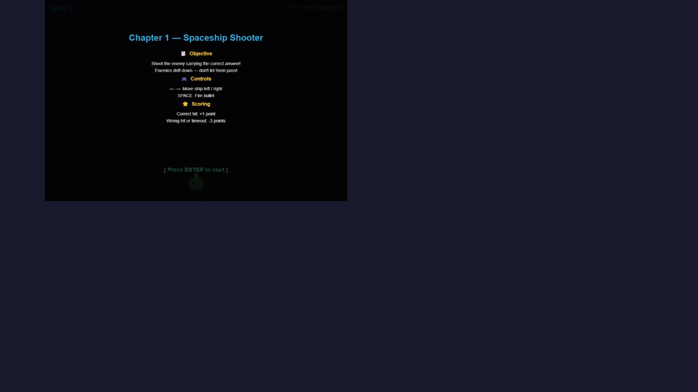
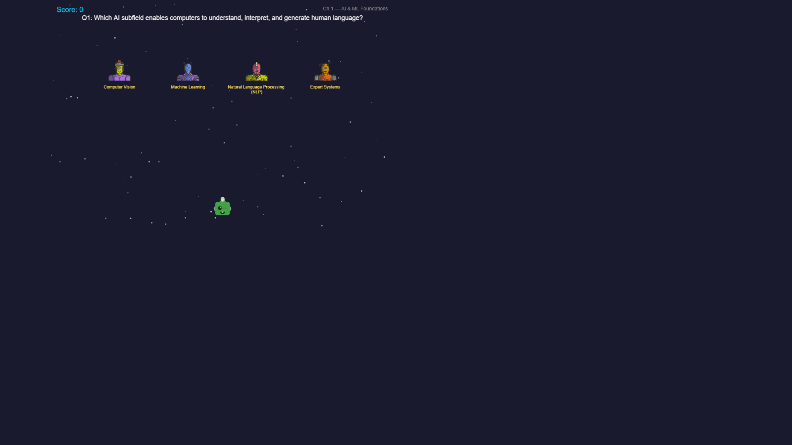

# Emerging Tech — ML Game

An arcade-style educational game that teaches Machine Learning concepts through **7 themed chapters + a Final Boss fight**. Built with [Phaser 3](https://phaser.io/) and [Vite](https://vitejs.dev/).

---

## Quick Start

### Screenshots

| Rules Screen | Gameplay |
|:---:|:---:|
|  |  |

### Prerequisites

- **Node.js** v18 or later — [download here](https://nodejs.org/)
- **Git** — [download here](https://git-scm.com/)

### Install & Run

```bash
# 1. Clone the repository
git clone https://github.com/sankethrajpatil/EmerginTechGame.git
cd EmerginTechGame

# 2. Install dependencies
npm install

# 3. Start the dev server
npm run dev
```

The game opens automatically at **http://localhost:3000** (or the next available port).

### Build for Production

```bash
npm run build     # outputs to dist/
npm run preview   # preview the production build locally
```

---

## How to Play

Each chapter presents **4 quiz questions** from a different ML topic. Answer them using a unique arcade mechanic. Your **score carries over** between chapters.

| Chapter | Topic | Mechanic | Controls |
|---------|-------|----------|----------|
| **1** | AI & ML Foundations | Spaceship Shooter | ← → move, SPACE shoot |
| **2** | Neural Networks | Catch the Object | ← → move basket |
| **3** | NLP & Transformers | Platform Jumper | ← → steer (auto-bounce) |
| **4** | LLMs & PEFT | Memory Maze | ← → ↑ ↓ navigate |
| **5** | Sampling & Metrics | Whack-a-Bug | Mouse click |
| **6** | RAG & Semantic Search | Data Claw | ← → move, SPACE drop |
| **7** | Agents & Observability | Workflow Sorter | ← → move, SPACE stamp |
| **Boss** | All Topics Combined | Boss Fight | ← → move, SPACE shoot |

### Scoring

| Event | Points |
|-------|--------|
| Correct answer (Ch 1–7) | **+1** |
| Wrong answer (Ch 1–7) | **−3** |
| Correct hit (Boss) | **+2** |
| Wrong hit / miss (Boss) | **−5** |

**Rules are shown at the start of every chapter** — press ENTER to begin.

After defeating the Final Boss, you receive a letter grade (S / A / B / C / D / F) based on your cumulative score.

---

## Project Structure

```
src/
├── main.js                  # Phaser game config & scene registration
├── core/
│   ├── BootScene.js         # Splash screen
│   └── GameState.js         # Global score & state singleton
├── chapters/
│   ├── chapter1/            # Spaceship Shooter
│   ├── chapter2/            # Catch the Object
│   ├── chapter3/            # Platform Jumper
│   ├── chapter4/            # Memory Maze
│   ├── chapter5/            # Whack-a-Bug
│   ├── chapter6/            # Data Claw
│   ├── chapter7/            # Workflow Sorter
│   └── finalBoss/           # The Master Algorithm
└── ui/
    └── RulesOverlay.js      # Shared rules screen utility
```

Each chapter folder contains:
- `questions.js` — structured quiz data (id, question, options, correct_answer)
- `Chapter*Scene.js` — Phaser scene with game mechanics (< 500 lines each)

---

## Tech Stack

| Tool | Purpose |
|------|---------|
| [Phaser 3](https://phaser.io/) | HTML5 game framework |
| [Vite](https://vitejs.dev/) | Dev server & bundler |
| [DiceBear API](https://dicebear.com/) | Dynamic player/NPC avatars |
| [RoboHash API](https://robohash.org/) | Enemy & boss sprites |
| [Placehold.co](https://placehold.co/) | Option block textures |

**No local image assets** — all sprites load dynamically from APIs at runtime.

---

## Design Guidelines

- Every scene file stays **under 500 lines**
- **ES Modules** throughout — no CommonJS
- **GameState.js** is the single source of truth for score & progress
- Modular architecture — each chapter is self-contained
- No local image files — all assets from external APIs

---

## License

MIT